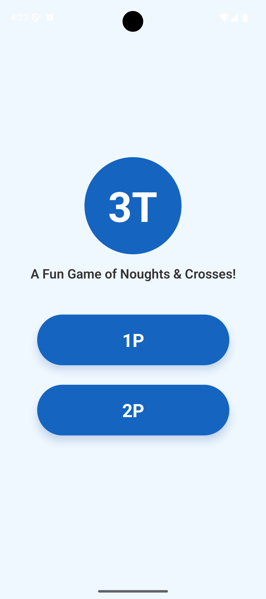
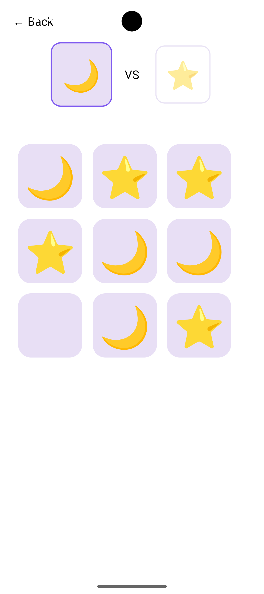
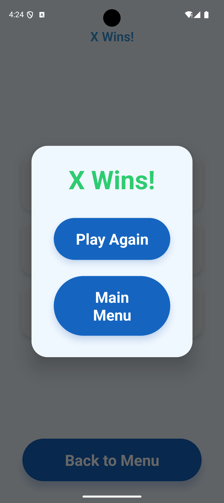

# 3T - Tic Tac Toe

**A Fun Game of Noughts & Crosses!**

A modern, arcade-style tic tac toe game built with React Native and Expo. Challenge the AI in single-player mode or compete with a friend in two-player mode.

## Screenshots

<p align="center">
  
  
  
</p>

## Features

- **Single Player (1P)**: Challenge an AI opponent
- **Two Player (2P)**: Play against a friend on the same device
- **Clean UI**: Modern arcade-style design with intuitive controls
- **Game State Management**: Automatic turn tracking and win detection
- **Replay System**: Quickly start a new game or return to the main menu

## Getting Started

### Prerequisites

Make sure you have completed the React Native Environment Setup for both [iOS](https://reactnative.dev/docs/set-up-your-environment?os=macos&platform=ios) and [Android](https://reactnative.dev/docs/set-up-your-environment?os=macos&platform=android).

You'll need:
- Node.js >= 20.19.4 < 23
- Xcode (for iOS development)
- Android Studio (for Android development)

### Installation

1. Clone the repository
2. Install dependencies:
   ```sh
   ./scripts/init.sh
   ```

### Running the App

```sh
# Run on iOS
npm run ios

# Run on Android
npm run android
```

## Development

This project uses:
- **React Native** with **Expo** for cross-platform mobile development
- **TypeScript** for type safety
- **ESLint** and **Prettier** for code quality
- **Jest** and **React Native Testing Library** for unit testing
- **Maestro** for E2E testing

### Package Manager

This project includes lock files for both NPM and Yarn. Choose your preferred package manager:

```sh
# For NPM
rm -rf yarn.lock
./scripts/init.sh

# For Yarn
rm -rf package-lock.json
./scripts/init.sh
```

## License

This project is MIT licensed and open-source.
